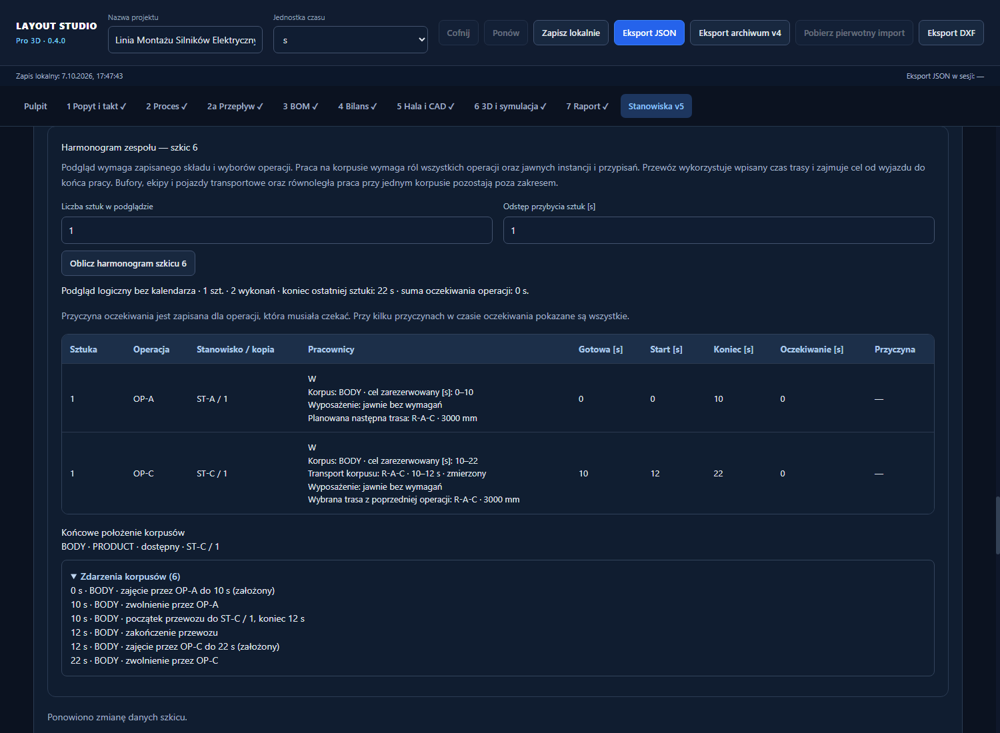
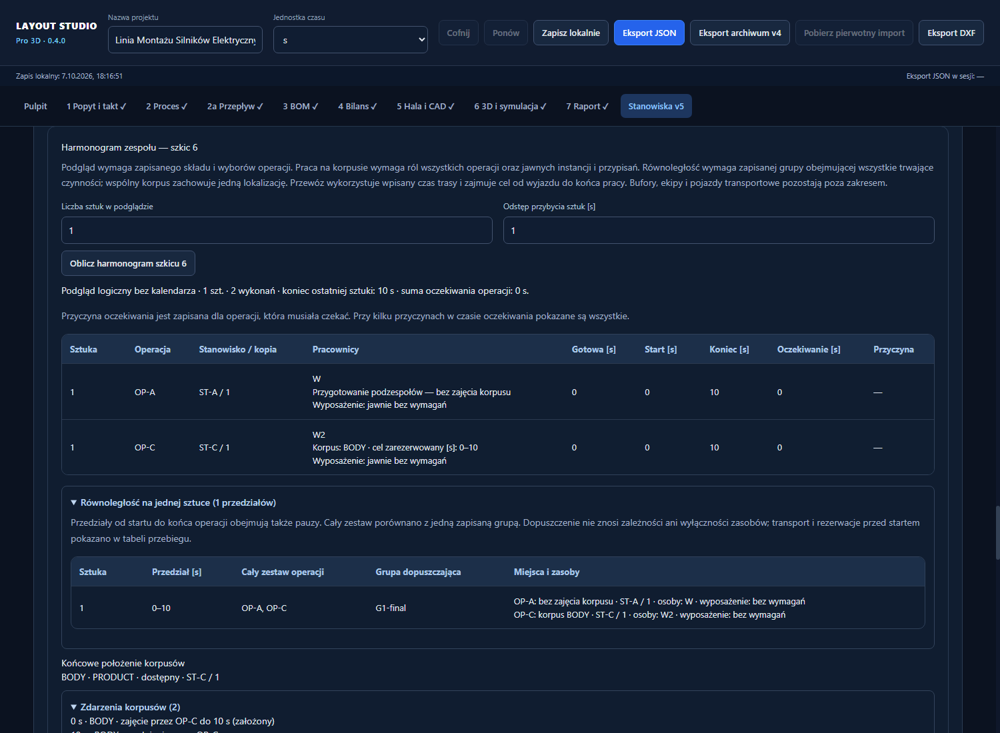
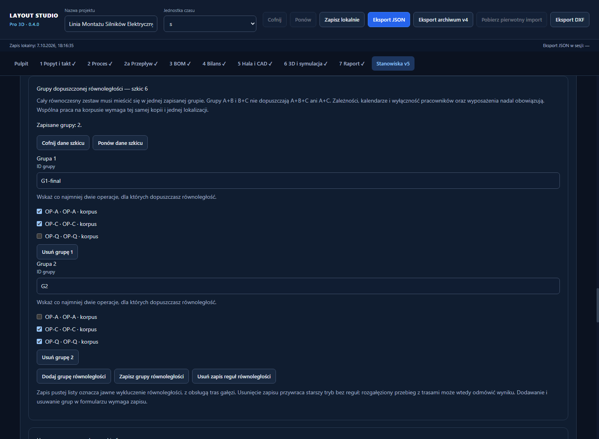
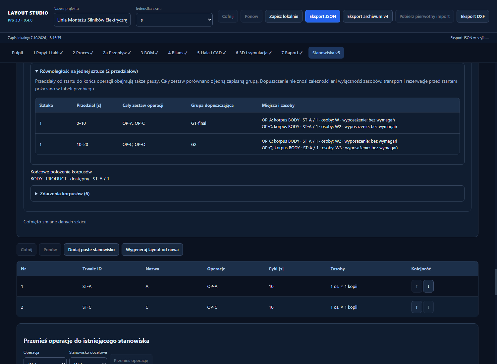

# Korpus i podzespoły w szkicu 6

Odbiór 2.7.4: 2026-10-07. Funkcje są dostępne w zakładce **Stanowiska v5**, w sekcji **Model procesu — szkic schematu 6**. Szkic ma osobny zapis; aktywne projekty 4/5 zachowują swój bilans i symulację.

1. W definicjach wyrobu i podzespołów uzupełnij rzeczywiste ID i powiązania. Dla przygotowania podzespołu wskaż jego operację tworzącą.
2. W **Korpus i role operacji** wybierz operację i rolę: przygotowanie wskazanych podzespołów lub praca na korpusie. Zapisz rolę. Przebieg fizyczny wymaga ról wszystkich operacji; brak danych nie przypisuje roli automatycznie.
3. Dodaj każdy korpus jawnie. Podaj numer sztuki, własne ID instancji, wyrób oraz początkowe stanowisko i kopię. Numery sztuk mają obejmować 1…liczbę wpisów, bez powtórzeń. Zapisz korpusy przebiegu.
4. W edytorze tras zaznacz **Podaj czas transportu korpusu** dla wymaganych przewozów. Wpisz dodatni czas w sekundach, pochodzenie (zmierzony/założony) i źródło. Po edycji potwierdź długość trasy i zapisz. Długość w mm nie zastępuje czasu przewozu.
5. W podglądzie harmonogramu wpisz jawny odstęp przybycia sztuk i oblicz przebieg. Liczba sztuk jest początkowo zgodna z zapisanymi przypisaniami; jej zmiana wymaga zgodnej listy korpusów. Panel dopuszcza do 100 sztuk.

Wynik pokazuje korpus, rezerwację celu, osobno transport i start pracy, końcowe lokalizacje oraz rozwijaną listę zdarzeń. Cel jest zajęty od wyjazdu do końca operacji, także podczas oczekiwania i przerw. Podczas przewozu korpus nie jest dostępny na żadnym końcu trasy. Przygotowanie podzespołu nie zajmuje korpusu.

Przyciski **Cofnij dane szkicu** i **Ponów dane szkicu** obsługują wspólną historię zmian definicji, ról, tras i korpusów w bieżącej sesji. Zapisane role, czasy i przypisania pozostają po przeładowaniu. Historia i odstęp przybycia nie są zachowywane po przeładowaniu; wpisz odstęp ponownie przed obliczeniem. Wynik nie zmienia zapisanej lokalizacji początkowej — kolejny przebieg zaczyna od tych samych deklaracji.

Błędny wpis nie nadpisuje poprawnego zapisu. Usunięcie używanego podzespołu, wyrobu lub roli może wymagać wcześniejszego usunięcia zapisu korpusów lub zależnej roli. Możesz usunąć zapis korpusów i cofnąć tę zmianę.

Zakres po odbiorze 2.8: jawny przebieg korpusu, definicje podzespołów i dopuszczone grupy równoległości, także przy rozgałęzionym grafie. Instancje/zużycie podzespołów, bufory i pojemności ekip oraz pojazdów pozostają poza zakresem. Screenshots przedstawiają dane syntetycznych testów, a nie pomiary procesu produkcyjnego.

## Grupy równoległości — odbiór 2.8.3

Po zapisaniu ról wszystkich operacji otwórz **Grupy dopuszczonej równoległości**, dodaj grupę, wpisz własne ID i zaznacz co najmniej dwie operacje. Kliknij **Zapisz grupy równoległości**. Możesz zmienić ID lub skład, usunąć grupę z formularza i zapisać zmianę. Błędna grupa nie nadpisuje poprawnych danych. Cofnij/Ponów korzysta ze wspólnej historii szkicu; edytor odświeża się po każdej zapisanej zmianie.

Cały jednoczesny zestaw musi mieścić się w jednej grupie. Grupy A+B i B+C pozwalają na te pary, ale nie na A+C ani A+B+C. Podzbiór większej grupy jest dopuszczony. Zezwolenie nie usuwa zależności grafu, wymagań obsady, kalendarzy ani wyłączności osoby/egzemplarza wyposażenia. Wspólny korpus może mieć równoległe prace tylko w jednej lokalizacji i na tej samej kopii; przewóz czeka na koniec wszystkich jego prac. Niezależne przygotowanie może odbywać się w innym miejscu.

Zapis pustej listy grup jawnie wyklucza równoległość, zachowując obsługę tras gałęzi. **Usuń zapis reguł równoległości** przywraca dawny tryb bez reguł; rozgałęziony przebieg z trasami może wtedy odmówić wyniku. Obie zmiany można cofnąć. Zapisane grupy pozostają po przeładowaniu, a historia sesji nie.

Po obliczeniu otwórz **Równoległość na jednej sztuce**. Inspekcja pokazuje przedziały od startu do końca czynności (także pauzy), cały zestaw, jedną grupę dopuszczającą, kopie, korpusy, osoby i wymagane wyposażenie. Nie pokazuje trójki jako dwóch odrębnych zgód. Brak równoległego przedziału może wynikać z zależności lub braku zasobów — przyczyny oczekiwania są w tabeli przebiegu. Transport i rezerwacje przed startem pokazano osobno. Inspekcja wyświetla pierwsze 100 przedziałów; podana liczba obejmuje wszystkie.

Stanowiska wybierane są automatycznie: najwcześniejszy start, potem rzeczywista droga przychodząca, a w dalszym remisie odległości według kolejności technologicznej gałęzi, bez sumowania. Przyszły cel nie jest zarezerwowany przez samą preferencję i może zmienić się przy rzeczywistym przydziale. Przygotowania podzespołów nie wyznaczają drogi korpusu. Rzeczywiste dopuszczenia i dane procesu Eko wymagają osobnego odbioru w 2.9.

## Obliczenia w tle — 3.1.1

Przycisk **Oblicz harmonogram szkicu 6** uruchamia osobne zadanie w tle. Licznik pokazuje zakończone wykonania względem całej partii; nie jest przewidywanym czasem zakończenia. Podczas obliczeń możesz użyć **Anuluj obliczenia szkicu 6**. Anulowanie nie zapisuje częściowego wyniku, a kolejny start zaczyna nowe obliczenie.

Zmiana parametrów lub zapis danych szkicu kończy poprzednie zadanie i usuwa nieaktualny wynik. Dane wejściowe i lokalizacje początkowe nie zmieniają się przez obliczenie. Po błędzie uruchomienia zadania panel pokazuje komunikat. Aktywna symulacja projektów 4/5 jest osobną ścieżką.

## Aktywna symulacja 4/5 — 3.1.2

Symulacja w zakładkach **6 3D i symulacja** oraz **Stanowiska v5** oblicza automatycznie po zmianie danych, partii lub odstępu. Podczas obliczeń pokazuje postęp i przycisk **Anuluj obliczenia symulacji**. Po anulowaniu można zmienić parametry albo użyć **Oblicz ponownie symulację**.

Odtwarzanie i CSV są dostępne po otrzymaniu pełnego wyniku. Prędkość, pauza i reset zmieniają odtwarzanie; **Oblicz całą partię** przechodzi do końca wyniku. Zmiana parametrów usuwa poprzedni wynik i oznacza poprzednio pobrany CSV jako nieaktualny. Obliczenia nie zmieniają danych projektu. Model 4/5 zachowuje założenia widoczne w panelu i pozostaje osobną ścieżką względem szkicu 6.

## Punkty i połączenia materiałowe — 3.2

W panelu **Punkty i połączenia materiałowe** dodaj punkt i wpisz jego ID oraz nazwę. Wybierz kierunek **Wejście**, **Wyjście** albo **Wejście i wyjście**. Dla punktu stanowiska wskaż konkretną kopię; punkt zewnętrzny może oznaczać np. magazyn. Jedna kopia może mieć osobne wejście i wyjście.

Dodaj połączenie, wpisz ID i wybierz punkty **od** oraz **do**. Połączenie jest skierowane: początek musi dopuszczać wyjście, a koniec wejście. Dla dwóch punktów stanowisk wybierz istniejącą trasę. Panel pokaże jej długość, źródło i ewentualny czas; dane tej drogi zmieniasz w edytorze dopuszczeń i tras. Nie musisz wpisywać ich ponownie.

Dla połączenia z punktem zewnętrznym wpisz długość, wybierz **mm** albo **m**, podaj źródło i potwierdź dane. Zmiana jednostki przelicza prezentację tej samej długości. Zmiana danych trasy wymaga ponownego potwierdzenia. Użyj **Zapisz sieć materiałową**; zmiany formularza stają się trwałe dopiero po poprawnym zapisie.

Punkt używany przez połączenie można usunąć dopiero po usunięciu lub zmianie tego połączenia. **Cofnij dane szkicu** i **Ponów dane szkicu** obejmują zapis sieci i pozostałe dane szkicu. **Usuń zapis sieci materiałowej** usuwa całą opcjonalną sieć; tę zmianę także można cofnąć w bieżącej sesji.

Zgodnie z wybranym zakresem 1A magazyn jest punktem sieci. Definicja połączenia magazynowego nie włącza dostawy do przebiegu korpusu. Wyliczanie czasu przewozu i zasoby transportowe należą do dalszych etapów.
