# Layout Studio Pro 3D — Podręcznik Użytkownika

Wersja aplikacji: **0.4.0**  
Przeznaczenie: **Inżynieria procesów produkcyjnych, bilansowanie linii, projektowanie layoutu 2D/3D oraz symulacja przepływu partii**.

---

## 1. Jak uruchomić program

Aplikacja jest lokalnym narzędziem inżynierskim działającym w środowisku przeglądarkowym.

1. **Uruchomienie skrótem**: Kliknij dwukrotnie plik `Uruchom_Layout_Studio_v0.3.bat` w głównym katalogu programu.
2. **Uruchomienie z terminala**:
   ```bash
   npm run build
   npm start
   ```
3. Otwórz przeglądarkę pod adresem: [http://127.0.0.1:4173](http://127.0.0.1:4173) (lub port wskazanym w konsoli).
4. **Bezpieczeństwo danych**: Wszystkie dane są zapisywane lokalnie w pamięci Twojej przeglądarki (`localStorage`). Przed wyczyszczeniem pamięci podręcznej zawsze wykonaj **Eksport JSON** lub **Eksport archiwum**.

---

## 2. Krok po kroku: Praca z aplikacją

### Krok 1: Pulpit projektu (Wybór szablonu lub własny proces)
Na ekranie startowym możesz wybrać jeden z gotowych przykładów referencyjnych lub rozpocząć czysty projekt:
- **Rozpocznij od zera**: Czysta baza do wprowadzenia własnego procesu klienta i BOM.
- **Przykład — silniki EV**: 6 operacji w gnieździe U-Shape.
- **Przykład — baterie EV**: 6 operacji w przepływie liniowym.
- **Przykład — Eko, rybia ość**: Złożony proces montażowy (16 operacji, 60 pozycji BOM, równoległe podmontaże).

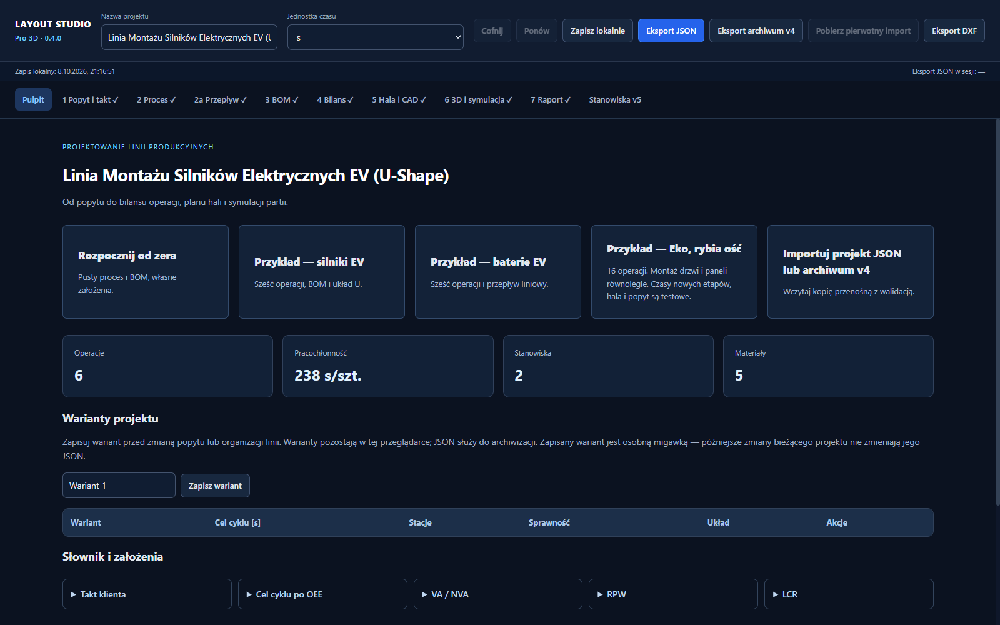

Na pasku górnym masz stały dostęp do:
- **Cofnij / Ponów**: Historia do 40 operacji w danej sesji.
- **Jednostka czasu**: Globalne przełączanie między sekundami (`s`), minutami (`min`) i godzinami (`h`).
- **Zapis lokalny & Eksport JSON / Archiwum**: Natychmiastowe zabezpieczenie stanu pracy.
- **Eksport DXF**: Eksport rzutu hali do systemów CAD.

---

### Krok 2: Zakładka 1 — Popyt, Takt i Czas Pracy
Zdefiniuj założenia wejściowe klienta:
- **Popyt roczny i dni robocze**: Wyliczają średni popyt dzienny.
- **Liczba zmian, godziny zmiany i planowane przerwy**: Wyliczają dostępny czas netto.
- **Rezerwa OEE / Dostępność [%]**: Założenie planistyczne uwzględniające straty operacyjne.
- Program automatycznie oblicza kluczowe wskaźniki Lean: **Takt klienta** oraz **Docelowy takt po OEE (Cycle Time Target)**.

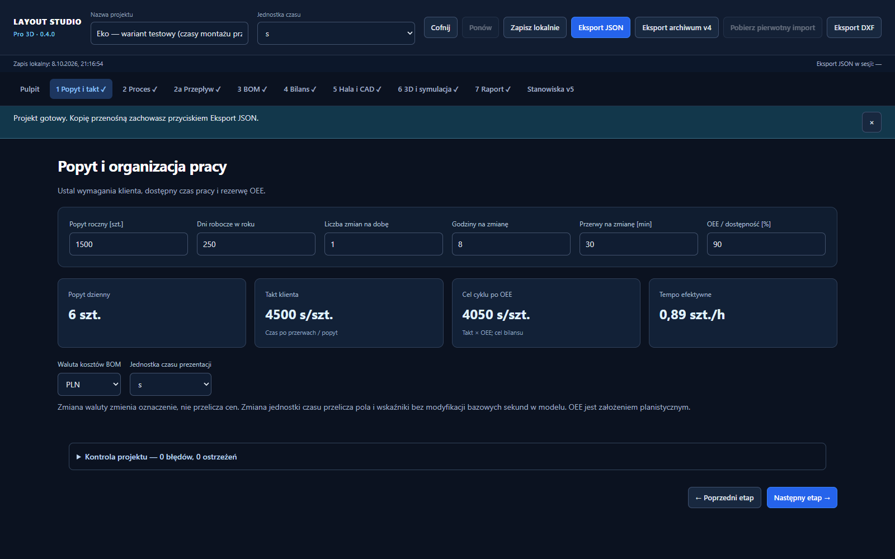

---

### Krok 3: Zakładka 2 — Proces i operacje technologiczne
Tabela operacji pozwala na pełną kontrolę struktury technologicznej:
- **ID i Nazwa operacji**: Unikalne identyfikatory kroków (np. `OP10`, `OP20`).
- **Czas standardowy, VA (wartość dodana) i NVA (strata)**: Rozbicie czasu pracy.
- **Zależności (Poprzednicy i Następnicy)**: Definiowanie relacji logicznych (AND) – program pilnuje spójności grafu i blokuje powstawanie cykli.
- **Import / Eksport XLSX & CSV**: Możliwość pobrania gotowego wzorca (`Szablon XLSX` / `Szablon CSV`) z osobnym arkuszem specyfikacji kolumn.

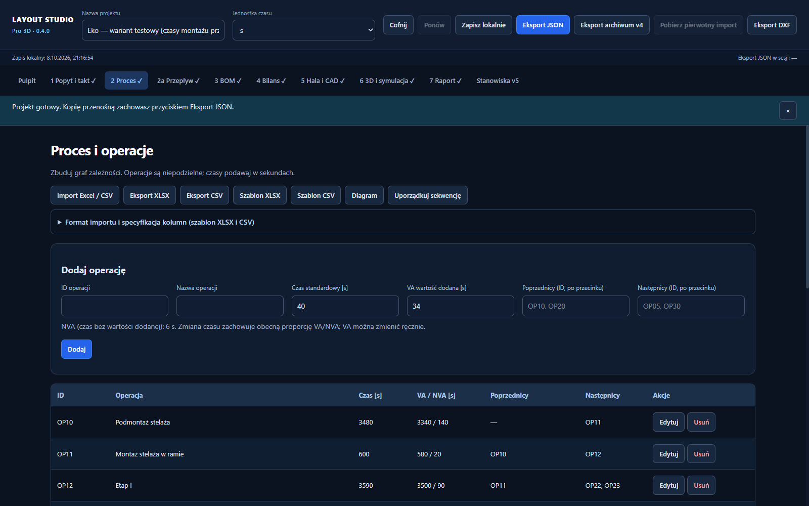

---

### Krok 4: Zakładka 2a — Wizualny diagram przepływu
Interaktywny edytor grafu sieciowego:
- **Kafelki operacji**: Prezentują ID, czas, udział VA oraz liczbę przypisanych części.
- **Przeciąganie i układ**: Pełna swoboda rozmieszczania, siatka 20 px, zoom oraz funkcja *Ułóż według zależności*.
- **Łączenie**: Możliwość tworzenia połączeń technologicznych bezpośrednio z portów `+`.

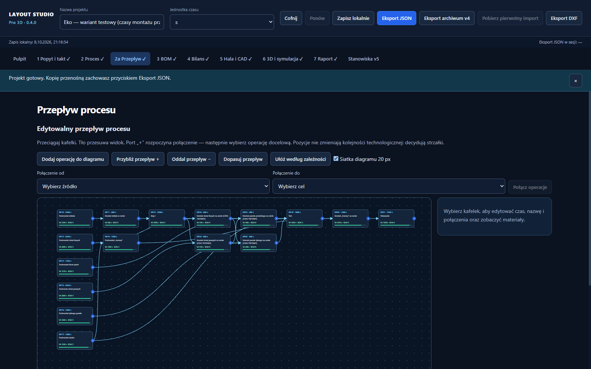

---

### Krok 5: Zakładka 3 — BOM i logistyka pojemników
Zarządzanie strukturą materiałową:
- Powiązanie komponentów z konkretnymi operacjami procesu.
- Dobór nośników logistycznych: **BoxKLT**, **Tray**, **Carton**, **Pallet**.
- Automatyczne wyliczanie: zapotrzebowania dziennego, liczby pojemników na zmianę oraz kosztu materiałowego wyrobu.

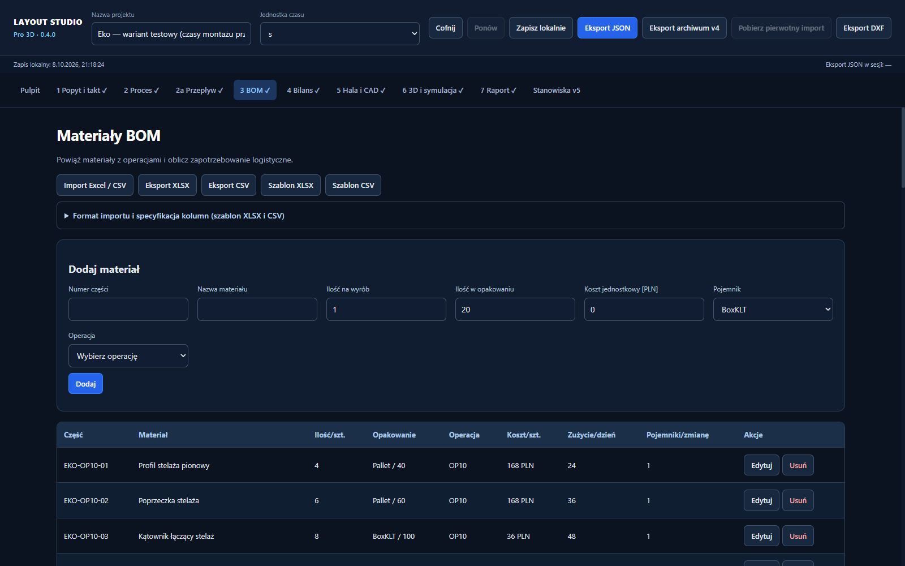

---

### Krok 6: Zakładka 4 — Bilansowanie linii i wykres Yamazumi
Narzędzie do optymalizacji obsady i równoważenia obciążenia:
- **Algorytmy i ręczny balans**: Wsparcie dla metod RPW, LCR lub ręcznego podziału na stacje.
- **Dynamiczny wykres Yamazumi**: Słupki reprezentują obciążenie poszczególnych stanowisk względem linii taktu docelowego (żółta linia przerywana).
- **Zasoby stacji**: Możliwość definiowania liczby operatorów (1–20), równoległych kopii stanowiska (1–20) oraz dedykowanego cyklu zespołu.

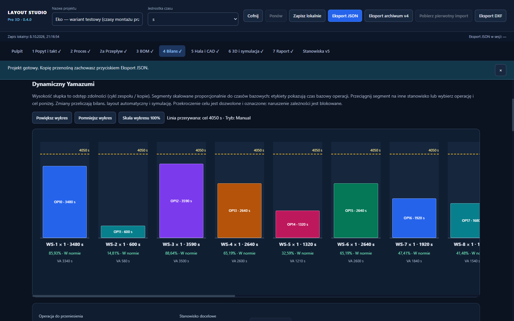

---

### Krok 7: Zakładka 5 — Hala i edytor CAD 2D
Projektowanie przestrzenne rozmieszczenia stacji roboczych:
- **Geometria hali**: Szerokość, długość i wysokość obiektu oraz regulowana siatka przyciągania.
- **Automatyczny generator layoutu**: Generowanie układów w kształcie **U**, **Liniowym**, **L** lub **Z procesu (rybia ość)**.
- **Elementy składowe stanowiska**: Stół ESD, regał buforowy FIFO, strefa pracy operatora.
- **Relacje technologiczne**: Fioletowe linie łączące stoły wskazują kierunek przepływu detalu.

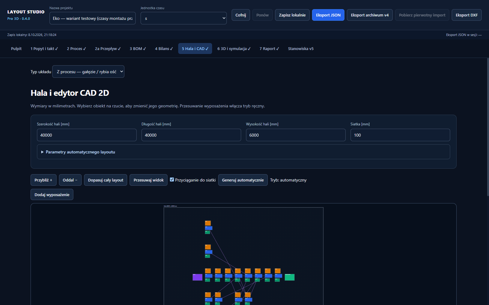

---

### Krok 8: Zakładka 6 — Widok 3D i Symulacja partii produkcyjnej
Cyfrowy bliźniak i symulator zdarzeniowy:
- **Nawigacja 3D**: Lewy przycisk myszy – obrót sceny, prawy – przesuwanie (pan), kółko – zoom.
- **Tryb edycji 3D**: Przesuwanie wyposażenia po posadzce hali z zachowaniem siatki.
- **Deterministyczna symulacja w tle (Web Worker)**:
  - Ustawienie wielkości partii (np. 30 sztuk) oraz odstępu uruchamiania detali.
  - Szybkości odtwarzania od 1× do 5000× z zachowaniem pełnej precyzji zdarzeń.
  - Wskaźniki w czasie rzeczywistym: czas symulowany, ukończone wyroby, WIP (produkcja w toku), średnia wydajność linii (szt./h) oraz stan poszczególnych stacji.
  - Eksport dokładnego przebiegu zdarzeń do pliku CSV.

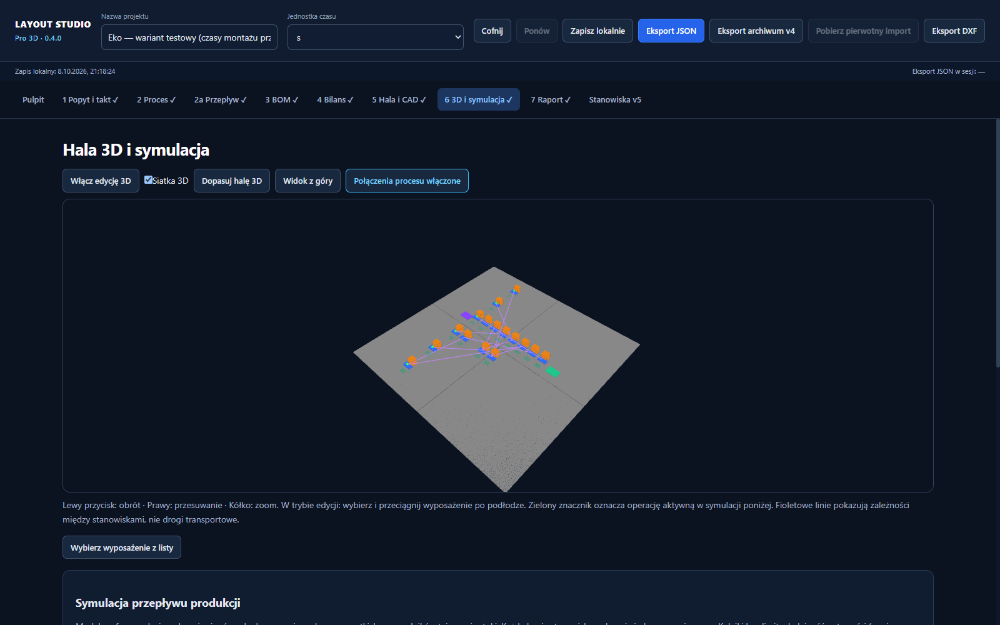
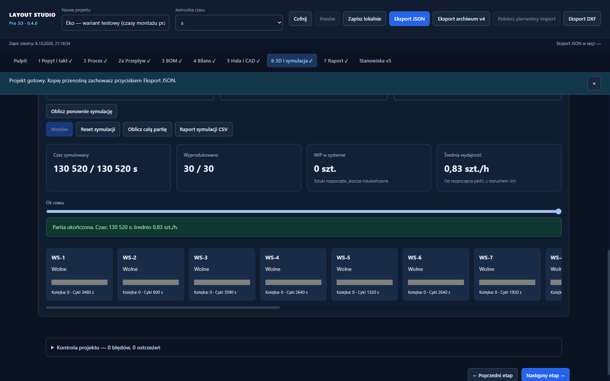

---

### Krok 9: Zakładka 7 — Raport inżynierski
Zestawienie podsumowujące projekt:
- Parametry popytu, taktu i dostępności.
- Bilans stanowisk, obsada, wąskie gardła i wyliczona sprawność.
- Struktura kosztowa BOM i weryfikacja kolizji layoutu.
- Przycisk generowania wydruku / zapisu do PDF bezpośrednio z przeglądarki.

---

### Krok 10: Moduł zaawansowany — Stanowiska v5 i Szkic Schematu 6
Dedykowane środowisko dla złożonych procesów montażowych:
- **Trwałe identyfikatory (`ST-...`)**: Gwarancja, że zmiana kolejności stacji, podział lub usunięcie operacji nie zniszczy przypisanych zasobów ani wyposażenia layoutu.
- **Kontrola layoutu**: Zabezpieczenie przed brakującymi stołami lub wyposażeniem przed uruchomieniem symulacji.
- **Nowy model procesu (Szkic 6)**:
  - Rejestr fizycznych instancji wyrobu / korpusu i ich przemieszczeń.
  - Operatorzy współdzieleni i rezerwacje pracowników bez podwójnego przypisania.
  - Indywidualne kalendarze zmian i przerw.
  - Reguły dopuszczalnej równoległości montażu.

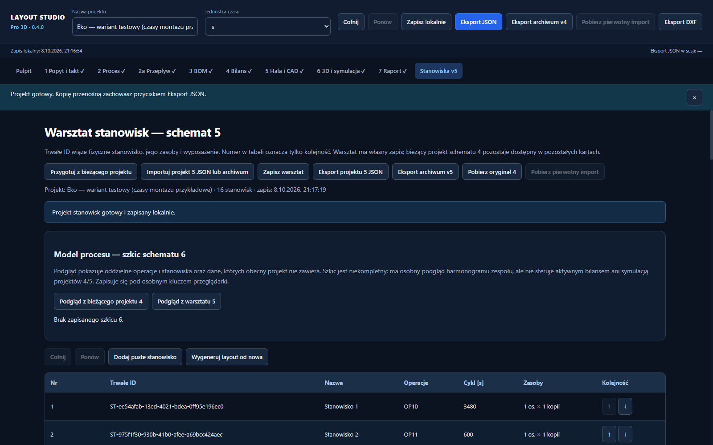
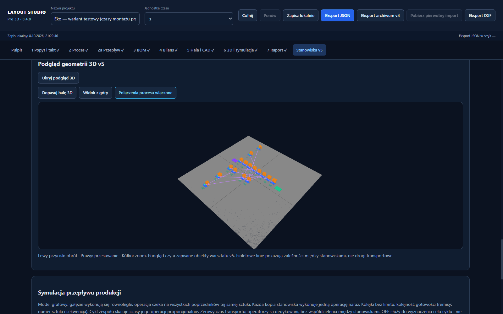

---

## 3. Ważne zasady Lean i ograniczenia modelu
1. **Czas nie dzieli się sam**: Dodanie drugiego pracownika do stacji nie skraca czasu automatycznie o połowę – należy podać zmierzony/założony czas zespołu.
2. **Animacja to nie obliczenia**: Ruch kamerą i szybkość odtwarzania 3D nie mają wpływu na matematyczny wynik symulacji partii.
3. **Ochrona geometrii**: Zmiana w technologii nie przestawia ręcznie dopracowanego layoutu w hali – program zgłasza ewentualną potrzebę korekty zamiast automatycznie niszczyć układ.
